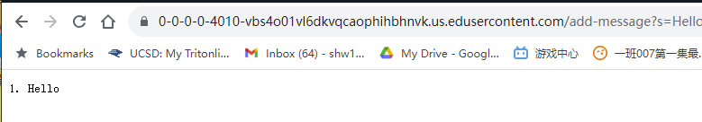
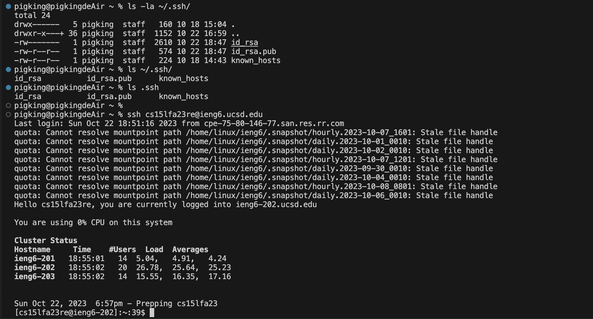

Methods called: main from StringServer, handle from ServerHttpHandler, and handleRequest from MessageHandler.args[0]: Port number for the main method.
url: The request URL for the handleRequest method. For message, It starts empty and gets updated with each new message in the format .

import java.io.IOException;
import java.net.URI;

class MessageHandler implements URLHandler {
    private StringBuilder messages = new StringBuilder();
    private int counter = 0;

    public String handleRequest(URI url) {
        if ("/add-message".equals(url.getPath())) {
            String query = url.getQuery();
            if (query != null && query.startsWith("s=")) {
                String message = query.substring(2);
                counter++;
                messages.append(counter).append(". ").append(message).append("\n");
            }
        }
        return messages.toString();
    }
}

public class StringServer {
    public static void main(String[] args) throws IOException {
        if(args.length == 0){
            System.out.println("Missing port number! Try any number between 1024 to 49151");
            return;
        }

        int port = Integer.parseInt(args[0]);

        Server.start(port, new MessageHandler());
    }
}
