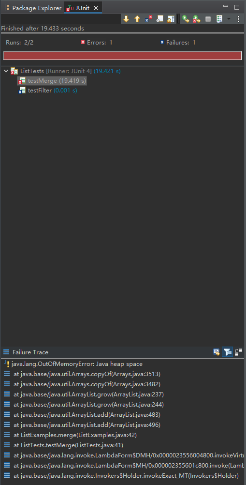
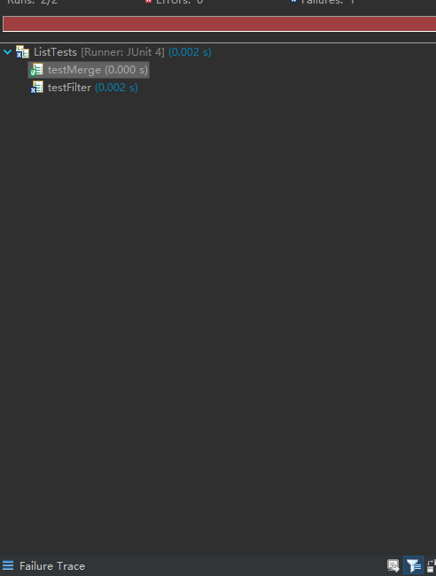

## Lab Report 3
Part 1
failure code
```
static List<String> merge(List<String> list1, List<String> list2) {
    List<String> result = new ArrayList<>();
    int index1 = 0, index2 = 0;
    while(index1 < list1.size() && index2 < list2.size()) {
      if(list1.get(index1).compareTo(list2.get(index2)) < 0) {
        result.add(list1.get(index1));
        index1 += 1;
      }
      else {
        result.add(list2.get(index2));
        index2 += 1;
      }
    }
    while(index1 < list1.size()) {
      result.add(list1.get(index1));
      index1 += 1;
    }
    while(index2 < list2.size()) {
      result.add(list2.get(index2));
      index1 += 1;
    }
    return result;
  }
```
after change
```
static List<String> merge(List<String> list1, List<String> list2) {
    List<String> result = new ArrayList<>();
    int index1 = 0, index2 = 0;
    while(index1 < list1.size() && index2 < list2.size()) {
        if(list1.get(index1).compareTo(list2.get(index2)) < 0) {
            result.add(list1.get(index1));
            index1 += 1;
        }
        else {
            result.add(list2.get(index2));
            index2 += 1; // This should increment index2, not index1
        }
    }
    // Add remaining elements from both lists
    while(index1 < list1.size()) {
        result.add(list1.get(index1));
        index1 += 1;
    }
    while(index2 < list2.size()) {
        result.add(list2.get(index2));
        index2 += 1; // Corrected from index1 to index2
    }
    return result;
}
```
the problem likely lies in the infinite loop within the merge method. The issue is that one of the loop's indexes is not being incremented correctly , causing an infinite loop if the second list (list2) finishes before the first one (list1).


part 2
1.The -E option enables the use of extended regular expressions, which allows for more complex patterns.
```
grep -E "(error|warning|fail)" ./technical/system/logs/*.log
```
This command searches for patterns that resemble dates (formatted as YYYY-MM-DD) at the beginning of lines in the access.log file.
```
grep -E "^[0-9]{4}-[0-9]{2}-[0-9]{2}" ./technical/logs/access.log
```
This searches for any of the words "error", "warning", or "fail" in all .log files within the ./technical/system/logs directory.
2. The -r option is recursive.
```
grep -r "function" ./technical/
```
This command recursively searches for the term "function" in all files within the ./technical directory and its subdirectories.
```
grep -r "^import" ./technical/scripts/
```
This recursively searches for lines that start with "import" in all files within the ./technical/scripts directory.
3.-v invert match .from  the official GNU
```
grep -v "deprecated" ./technical/documentation.txt
```
This command will display all lines that do not include the word "deprecated" in the file documentation.txt inside the ./technical directory.
```
grep -v "success" ./technical/results/output.txt
```
This command will show all lines from output.txt that do not contain the word "success".
4.--color colorize the matching text .This option is part of GNU Grep and is described in the GNU Grep documentation.
```
grep --color "data" ./technical/research/data_summary.txt
```
This command will search for "data" in data_summary.txt and highlight the matching text in color.
```
This command will search for "data" in data_summary.txt and highlight the matching text in color.
```
This searches for "todo" in tasks.md and displays the line numbers with the matching text highlighted in color.
cite:
https://www.gnu.org/software/grep/manual/grep.html
ChatGPT for asking: For the commands grep, find 4  command-line options or alternate ways to use the command. For each of those options, give 2 examples of using it on files and directories from ./technical.
