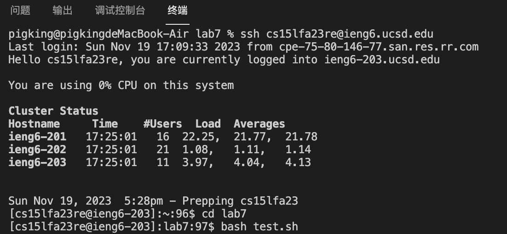
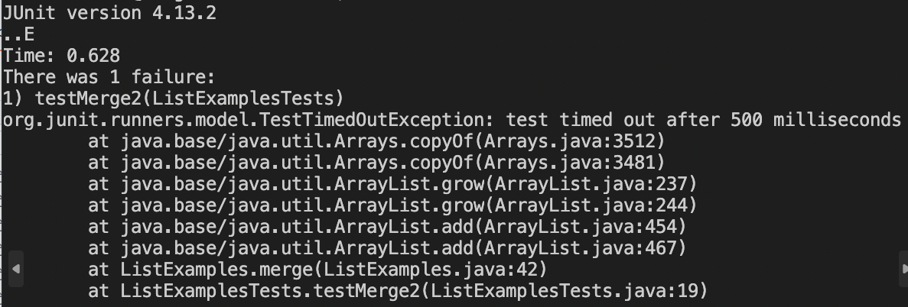
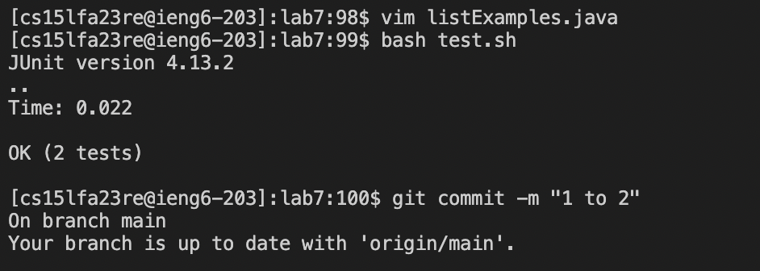

```<up><up><up><up><enter>```Use this command to find my account and log in,```<up><up><up><up><up><enter>``` cd lab7 command was 5 up in the search history, change the directory to lab7.```<up><up><up><enter>```bash test.sh command was 3 up in the history use this to run the test.```<up><up><up><up><enter>``` vim ListExamples.java was 4 up in the history,so i use this to get in to vim.```<:/index += 1;>``` find the place should be correct.```<right><right><right><right><right><x><I><2>```change the index1 to index2.```<esc><:wq>```to save the change and quit.```<up><up><enter>```bash test.sh command was 2 up in the history,run the test again.```<up><up><up><up><up><up><enter>```git commit -m was 6 up in the history.
